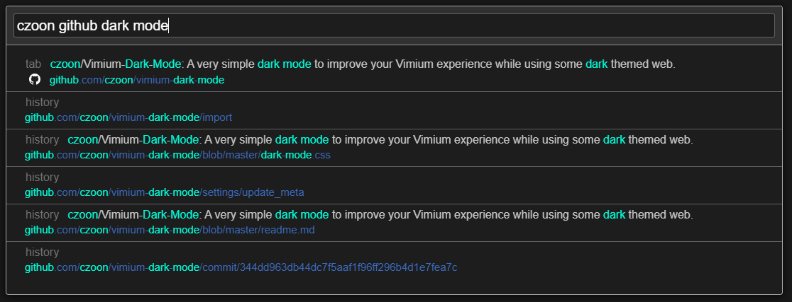

# Vimium Dark Mode

A very simple dark mode to improve your Vimium experience while using some dark themed web.

## Installation

- Clone the repository, or just access and copy to your clipboard the content inside *dark-mode.css*.  
- Access the Vimium options menu, and paste the content inside the input with the label *CSS for Vimium UI*.
- Save the changes with the save button at the bottom of the page.
- Reload the current tabs at your browser. The changes should have been applied.

